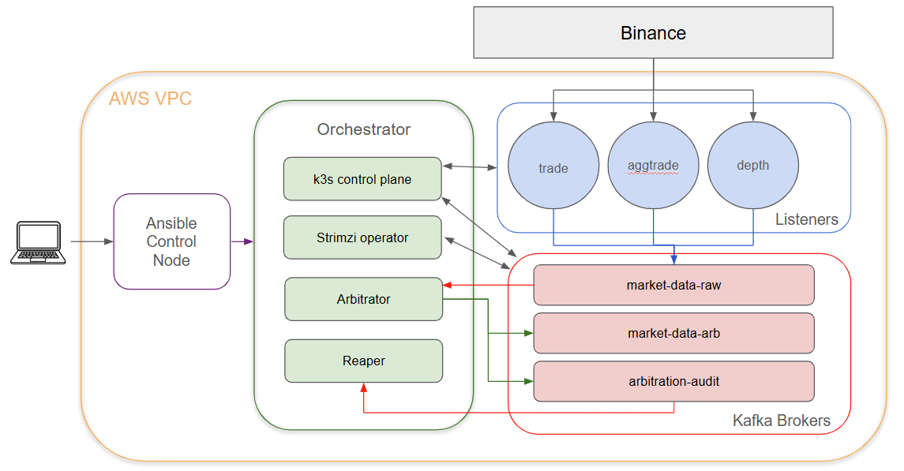

# binance-ws-md-aws

Self-healing arbitration of Binance market-data with periodic replacement of slowest stream.

## Components

Listeners:
- n listeners make a websocket connection to one of m binance market data streams (currently trade, aggtrade, and depth).  Each listener runs on its own EC2 instance and publishes raw events to Kafka topic market-data-raw.

Arbitrator:
- Consumes market-data-raw and produces a single deduplicated stream of updates to market-data-arb
- Tracks which source feed provided the fastest update and maintains a running tally for each stream
- Sends a verdict to arbitration-audit at a predetermined interval (20 minutes) specifying the slowest source.

Reaper:
- Consumes arbitration-audit topic and upon receiving a verdict will cordon drain and destroy the slowest EC2 instance.

Kafka:
- 3 Broker cluster managed by Strimzi with a replication factor defaulted to 3
- Topics:
  - market-data-raw
  - market-data-arb
  - arbitration-audit

Monitoring:
— Grafana Alloy DaemonSet scrapes every pod's /metrics and forwards to Grafana Cloud. 

## Infrastructure

Terraform:
- Used to provision AWS resources: VPC, EC2 Instances, security groups, IAM roles, and the ASGs described below.

AWS ASG (Auto Scaling Groups):
- Used to maintain a minimum k kafka nodes and l listener nodes (default to 3 kafka nodes and 15 listener nodes (5 nodes per stream * 3 streams))

Ansible:
- Used to configure the ansible control node, then bootstraps k3s on the orchestrator and deploys Kafka, the arbitrator, the reaper, and monitoring to the cluster

## Architecture

The diagram shows the full pipeline inside AWS VPC: Ansible provisions the stack; listener nodes pull trade, depth, and aggTrade streams from Binance into Kafka; the arbitrator consumes raw events and writes deduplicated and audit topics; the reaper acts on arbitration outcomes. k3s and Strimzi manage workloads across dedicated orchestrator, listener, and Kafka node pools.
